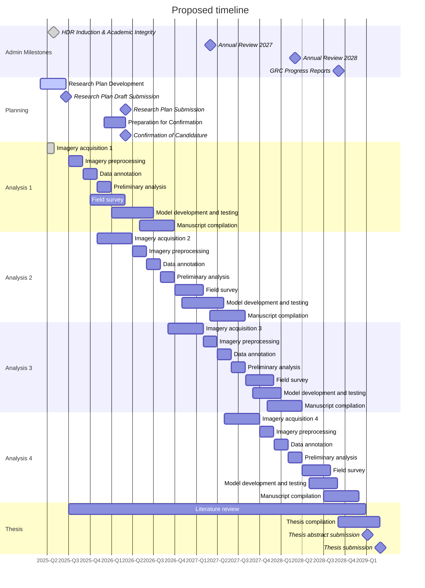

# Proposed timeline

```mermaid
gantt
    dateFormat  YYYY-MM-DD
    title Proposed timeline
    axisFormat %Y-Q%q
    todayMarker off

    section Admin Milestones
    HDR Induction & Academic Integrity    :milestone, done, 2025-04-28, 0d
    Annual Review 2027                    :milestone, 2027-03-03, 0d
    Annual Review 2028                    :milestone, 2028-03-02, 0d
    GRC Progress Reports                  :milestone, 2028-09-03, 0d

    section Planning
    Research Plan Development             :active, 2025-03-01, 2025-06-20
    Research Plan Draft Submission        :milestone, 2025-06-20, 0d
    Research Plan Submission              :milestone, 2026-03-03, 0d
    Preparation for Confirmation          :2025-12-01, 2026-03-03
    Confirmation of Candidature           :milestone, 2026-03-03, 0d

    section Analysis 1
    Imagery acquisition 1                 :done, 2025-04-01, 2025-04-30
    Imagery preprocessing                 :2025-07-01, 2025-08-31
    Data annotation                       :2025-09-01, 2025-10-31
    Preliminary analysis                  :2025-11-01, 2025-12-31
    Field survey                          :2025-10-01, 2026-02-28
    Model development and testing         :2026-01-01, 2026-06-30
    Manuscript compilation                :2026-05-01, 2026-09-30

    section Analysis 2
    Imagery acquisition 2                 :2025-11-01, 2026-03-31
    Imagery preprocessing                 :2026-04-01, 2026-05-31
    Data annotation                       :2026-06-01, 2026-07-31
    Preliminary analysis                  :2026-08-01, 2026-09-30
    Field survey                          :2026-10-01, 2027-01-31
    Model development and testing         :2026-11-01, 2027-04-30
    Manuscript compilation                :2027-03-01, 2027-07-31

    section Analysis 3
    Imagery acquisition 3                 :2026-09-01, 2027-01-31
    Imagery preprocessing                 :2027-02-01, 2027-03-31
    Data annotation                       :2027-04-01, 2027-05-31
    Preliminary analysis                  :2027-06-01, 2027-07-31
    Field survey                          :2027-08-01, 2027-11-30
    Model development and testing         :2027-09-01, 2027-12-31
    Manuscript compilation                :2027-11-01, 2028-03-31

    section Analysis 4
    Imagery acquisition 4                 :2027-05-01, 2027-09-30
    Imagery preprocessing                 :2027-10-01, 2027-11-30
    Data annotation                       :2027-12-01, 2028-01-31
    Preliminary analysis                  :2028-02-01, 2028-03-31
    Field survey                          :2028-04-01, 2028-07-31
    Model development and testing         :2028-05-01, 2028-08-31
    Manuscript compilation                :2028-07-01, 2028-11-30

    section Thesis
    Literature review                     :2025-07-01, 2028-12-31
    Thesis compilation                    :2028-09-01, 2029-02-28
    Thesis abstract submission            :milestone, 2029-01-06, 0d
    Thesis submission                     :milestone, 2029-03-03, 0d

```
