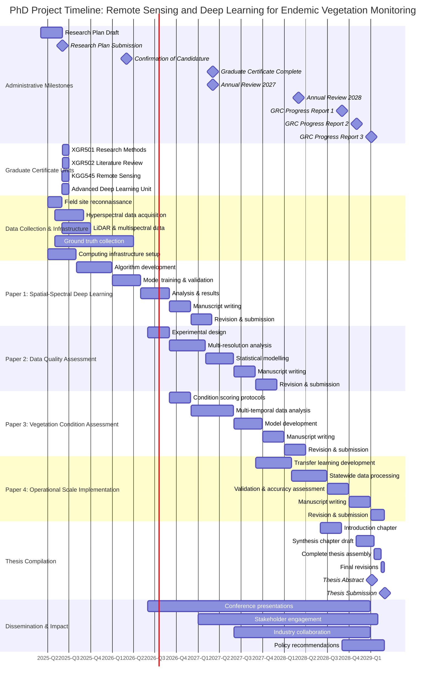

```mermaid
gantt
    dateFormat  YYYY-MM-DD
    title PhD Project Timeline: Remote Sensing and Deep Learning for Endemic Vegetation Monitoring
    axisFormat %Y-Q%q
    
    section Administrative Milestones
    Research Plan Draft            :2025-03-03, 2025-06-03 
    Research Plan Submission       :milestone, 2025-06-03, 0d 
    Confirmation of Candidature    :milestone, 2026-03-03, 0d 
    Graduate Certificate Complete  :milestone, 2027-03-03, 0d 
    Annual Review 2027             :milestone, 2027-03-03, 0d 
    Annual Review 2028             :milestone, 2028-03-02, 0d 
    GRC Progress Report 1          :milestone, 2028-09-03, 0d 
    GRC Progress Report 2          :milestone, 2028-11-04, 0d 
    GRC Progress Report 3          :milestone, 2029-01-04, 0d 
    
    section Graduate Certificate Units
    XGR501 Research Methods        :2025-06-03, 2025-06-30
    XGR502 Literature Review       :2025-06-03, 2025-06-30
    KGG545 Remote Sensing          :2025-06-01, 2025-06-30
    Advanced Deep Learning Unit    :2025-06-01, 2025-06-30
    
    section Data Collection & Infrastructure
    Field site reconnaissance      :2025-04-01, 2025-05-31
    Hyperspectral data acquisition :2025-05-01, 2025-08-31
    LiDAR & multispectral data     :2025-06-01, 2025-09-30
    Ground truth collection        :2025-05-01, 2026-03-31
    Computing infrastructure setup :2025-04-01, 2025-07-31
    
    section Paper 1: Spatial-Spectral Deep Learning
    Algorithm development          :2025-08-01, 2025-12-31
    Model training & validation    :2026-01-01, 2026-04-30
    Analysis & results             :2026-05-01, 2026-08-31
    Manuscript writing             :2026-09-01, 2026-11-30
    Revision & submission          :2026-12-01, 2027-02-28
    
    section Paper 2: Data Quality Assessment
    Experimental design            :2026-06-01, 2026-08-31
    Multi-resolution analysis      :2026-09-01, 2027-01-31
    Statistical modelling          :2027-02-01, 2027-05-31
    Manuscript writing             :2027-06-01, 2027-08-31
    Revision & submission          :2027-09-01, 2027-11-30
    
    section Paper 3: Vegetation Condition Assessment
    Condition scoring protocols    :2026-09-01, 2026-11-30
    Multi-temporal data analysis   :2026-12-01, 2027-05-31
    Model development              :2027-06-01, 2027-09-30
    Manuscript writing             :2027-10-01, 2027-12-31
    Revision & submission          :2028-01-01, 2028-03-31
    
    section Paper 4: Operational Scale Implementation
    Transfer learning development  :2027-09-01, 2028-01-31
    Statewide data processing      :2028-02-01, 2028-06-30
    Validation & accuracy assessment :2028-07-01, 2028-09-30
    Manuscript writing             :2028-10-01, 2028-12-31
    Revision & submission          :2029-01-01, 2029-02-28
    
    section Thesis Compilation
    Introduction chapter           :2028-06-01, 2028-08-31
    Synthesis chapter draft        :2028-11-01, 2029-01-15
    Complete thesis assembly       :2029-01-16, 2029-02-15
    Final revisions                :2029-02-16, 2029-02-28
    Thesis Abstract                :milestone, 2029-01-06, 0d 
    Thesis Submission              :milestone, 2029-03-03, 0d
    
    section Dissemination & Impact
    Conference presentations       :2026-06-01, 2028-12-31
    Stakeholder engagement         :2027-01-01, 2029-01-31
    Industry collaboration         :2027-06-01, 2028-12-31
    Policy recommendations         :2028-09-01, 2029-02-28
    
```
